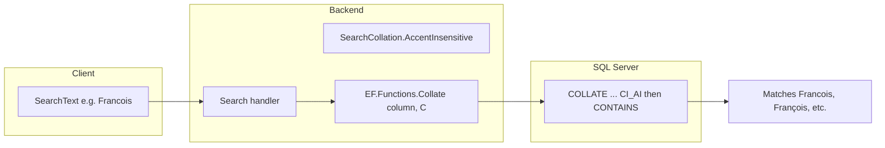

# Accent-insensitive search (Carrefour solidaire)

## Context

- **Current behavior**: [SearchBeneficiaries.cs](Sig.App.Backend/Requests/Queries/Beneficiaries/SearchBeneficiaries.cs) (and other search handlers) filter with `string.Contains(text)` on fields like `Firstname`, `Lastname`, `Email`, etc. Accented characters in the query or in the data do not match their unaccented counterparts (e.g. "François" vs "Francois").
- **Database**: SQL Server (see [Startup.cs](Sig.App.Backend/Startup.cs) `UseSqlServer`).
- **EF Core**: 8.0.1. Supports `EF.Functions.Collate(operand, collation)` to apply a collation per expression so that comparisons (e.g. `Contains`) are accent-insensitive without changing column or database default collation.
- **Existing asset**: [StringExtensions.cs](Sig.App.Backend/Extensions/StringExtensions.cs) has `RemoveAccents()` for in-memory use; for DB queries we keep the logic in SQL via collation so indexes can still be used.

## Approach: per-query collation (reusable)

Use **one shared collation constant** and, in every place that filters by `SearchText`, wrap the **column** (the left-hand side) in `EF.Functions.Collate(..., collation).Contains(searchTerm)`. The search term (parameter) is then compared in that same collation by SQL Server, so accents are ignored on both sides.

- **Pros**: No schema/migration, works with existing indexes (collation is applied in the expression), single place to change collation, easy to apply in multiple searches.
- **Collation**: SQL Server accent-insensitive (and case-insensitive): `SQL_Latin1_General_CP1_CI_AI` (CI = case insensitive, AI = accent insensitive).

## Implementation

### 1. Shared collation constant

- **Add** a small class under [Constants](Sig.App.Backend/Constants/) (e.g. `SearchCollation.cs`) in namespace `Sig.App.Backend.Constants`:
  - `public static class SearchCollation { public const string AccentInsensitive = "SQL_Latin1_General_CP1_CI_AI"; }`
- This keeps the collation name in one place so all searches stay consistent and can be tuned later (e.g. if you move to another locale).

### 2. Replace `.Contains(text)` with accent-insensitive comparison

In each file below, for every `SearchText` branch, replace each string `column.Contains(text)` with:

`EF.Functions.Collate(column, SearchCollation.AccentInsensitive).Contains(text)`

Add `using Microsoft.EntityFrameworkCore;` and `using Sig.App.Backend.Constants;` where missing.

**Handlers and report (8 places):**

| File                                                                                                                  | Fields to wrap with Collate().Contains(text)                                                                                                 |
| --------------------------------------------------------------------------------------------------------------------- | -------------------------------------------------------------------------------------------------------------------------------------------- |
| [SearchBeneficiaries.cs](Sig.App.Backend/Requests/Queries/Beneficiaries/SearchBeneficiaries.cs)                       | ID1, ID2, Email, Firstname, Lastname, CardNumber, CardNumber.Replace(...), ProgramCardId.ToString() (both branches: full info vs restricted) |
| [SearchOffPlatformBeneficiaries.cs](Sig.App.Backend/Requests/Queries/Beneficiaries/SearchOffPlatformBeneficiaries.cs) | ID1, ID2, Email, Firstname, Lastname                                                                                                         |
| [SearchUsers.cs](Sig.App.Backend/Requests/Queries/Users/SearchUsers.cs)                                               | Email, Profile.FirstName, Profile.LastName                                                                                                   |
| [SearchMarkets.cs](Sig.App.Backend/Requests/Queries/Markets/SearchMarkets.cs)                                         | Name.ToString()                                                                                                                              |
| [SearchCards.cs](Sig.App.Backend/Requests/Queries/Cards/SearchCards.cs)                                               | ProgramCardId.ToString(), CardNumber                                                                                                         |
| [SearchTransactionLogs.cs](Sig.App.Backend/Requests/Queries/Transactions/SearchTransactionLogs.cs)                    | BeneficiaryID1, BeneficiaryID2, BeneficiaryEmail, BeneficiaryFirstname, BeneficiaryLastname                                                  |
| [ExportBeneficiariesList.cs](Sig.App.Backend/Requests/Queries/Beneficiaries/ExportBeneficiariesList.cs)               | Same set as SearchBeneficiaries (ID1, ID2, Email, Firstname, Lastname, CardNumber, ProgramCardId)                                            |
| [ReportService.cs](Sig.App.Backend/Services/Reports/ReportService.cs)                                                 | BeneficiaryID1, BeneficiaryID2, BeneficiaryEmail, BeneficiaryFirstname, BeneficiaryLastname                                                  |

**Details:**

- **Nullable / conditional columns**: For expressions like `x.Card != null && x.Card.CardNumber.Contains(text)`, use `EF.Functions.Collate(x.Card.CardNumber, ...).Contains(text)` in the condition; the null check can stay as is (e.g. `x.Card != null && EF.Functions.Collate(x.Card.CardNumber, ...).Contains(text)`).
- **Non-string expressions**: For `ProgramCardId.ToString().Contains(text)`, use `EF.Functions.Collate(x.Card.ProgramCardId.ToString(), SearchCollation.AccentInsensitive).Contains(text)` so any string representation is compared accent-insensitive.
- **Market Name**: If `Name` is a value object with `ToString()`, use `EF.Functions.Collate(x.Name.ToString(), SearchCollation.AccentInsensitive).Contains(text)`.

No change to the way search terms are split (e.g. `request.SearchText.Value.Split(' ')`); the collation applies to the comparison in the database.

### 3. No migration

Collation is applied only in the query expression, not on the column definition, so no EF migration is required.

### 4. Optional: GenerateTransactionsReport

[GenerateTransactionsReport.cs](Sig.App.Backend/Requests/Queries/Transactions/GenerateTransactionsReport.cs) declares `SearchText` on the request; if it forwards to another handler or to ReportService, no extra change. If it has its own filter logic using `SearchText`, apply the same Collate pattern there.

## Summary flow

## Files to add

- `Sig.App.Backend/Constants/SearchCollation.cs` (new)

## Files to modify

- `Sig.App.Backend/Requests/Queries/Beneficiaries/SearchBeneficiaries.cs`
- `Sig.App.Backend/Requests/Queries/Beneficiaries/SearchOffPlatformBeneficiaries.cs`
- `Sig.App.Backend/Requests/Queries/Beneficiaries/ExportBeneficiariesList.cs`
- `Sig.App.Backend/Requests/Queries/Users/SearchUsers.cs`
- `Sig.App.Backend/Requests/Queries/Markets/SearchMarkets.cs`
- `Sig.App.Backend/Requests/Queries/Cards/SearchCards.cs`
- `Sig.App.Backend/Requests/Queries/Transactions/SearchTransactionLogs.cs`
- `Sig.App.Backend/Services/Reports/ReportService.cs`

(Plus [GenerateTransactionsReport.cs](Sig.App.Backend/Requests/Queries/Transactions/GenerateTransactionsReport.cs) only if it contains its own SearchText filter logic.)

## Testing

- Manual or automated: search with accented terms (e.g. "François", "José") and unaccented ("Francois", "Jose"); search with unaccented terms against data containing accents. Verify beneficiaries, users, markets, cards, transaction logs, exports, and report all behave consistently.

